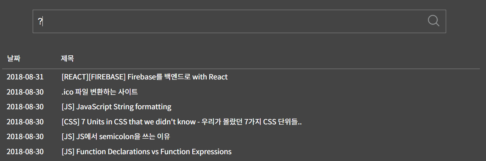

# dailydev
My development diary

## Ongoing projects

- [ ] [Diligent](https://github.com/soldier4443/Diligent) - Kotlin Network Helper library
- [ ] PMS - Project Management System
  - [ ] pms - Back-end server using python Django framework
  - [ ] pms-front - Cross-platform desktop/web app using React and Electron
  - [ ] pms-mobile - Mobile application using React Native

## Aborted projects

- [Jamquery Android][jamquery-github] - Android version of personal link manager, [Jamquery][jamquery-web]
  

- [AACSample][aac-sample-github] - GitHub repository sample app for demonstrating Android Architecture Components
  

[jamquery-github]: https://github.com/soldier4443/Jamquery-Android/
[jamquery-web]: http://jamquery.teamidus.com/
[aac-sample-github]: https://github.com/soldier4443/AACSample/
